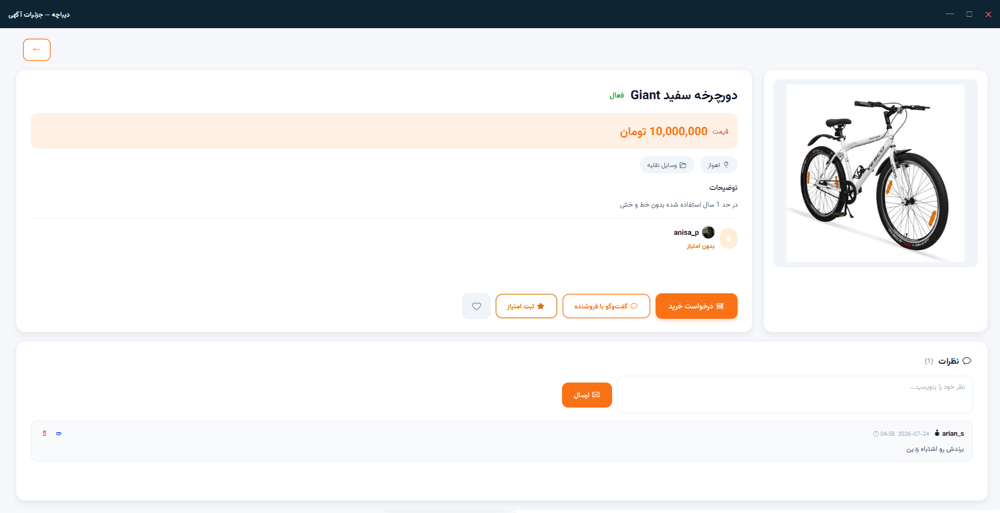
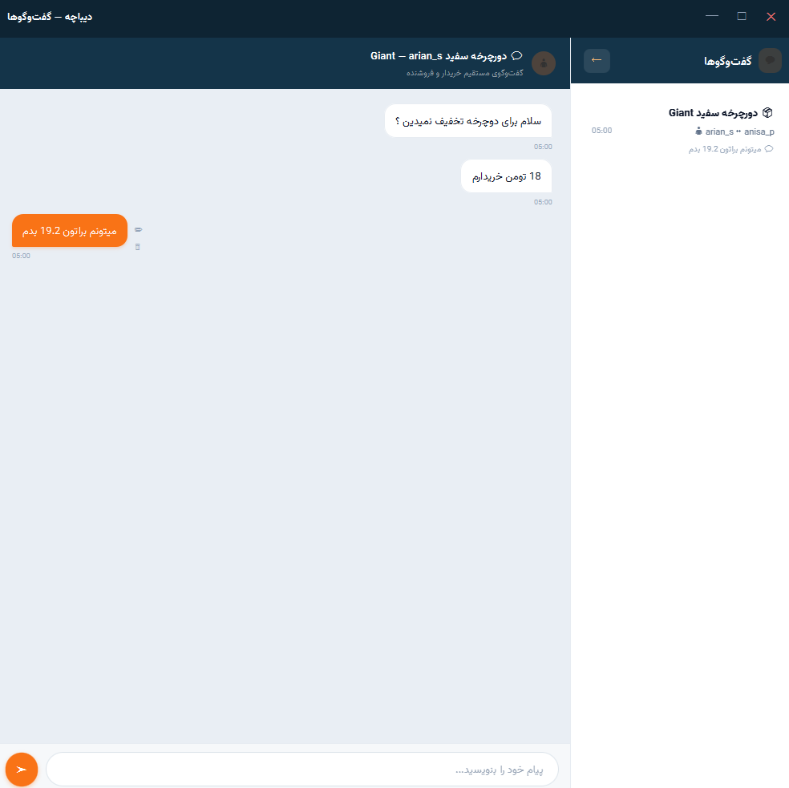
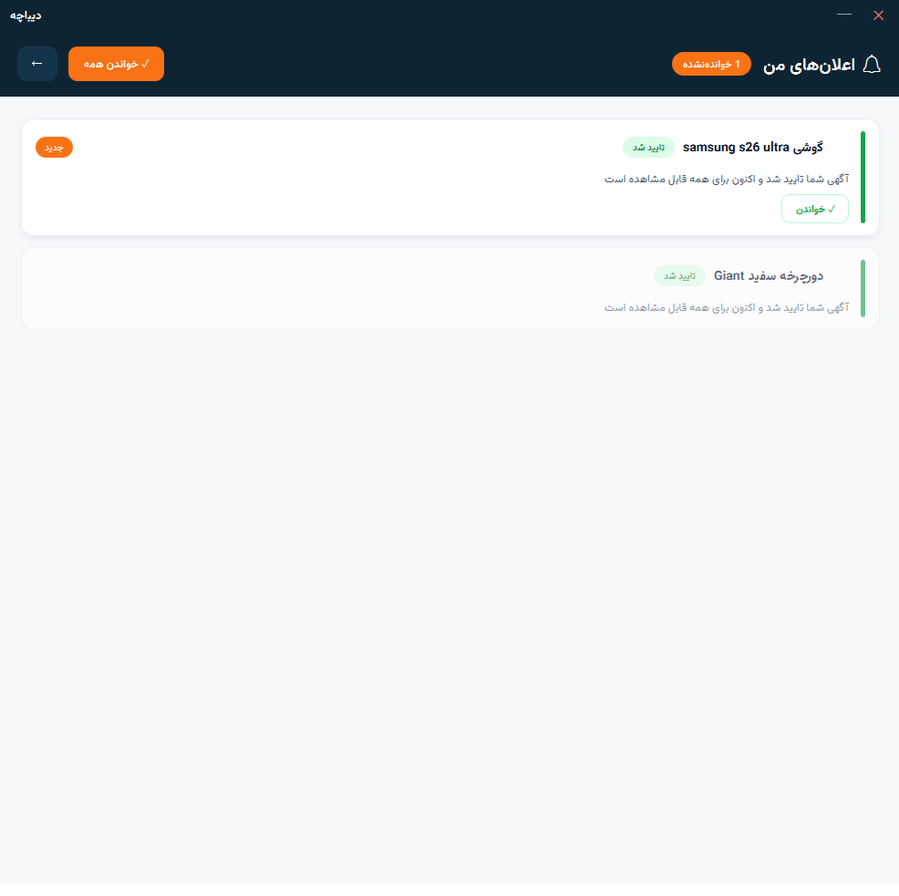
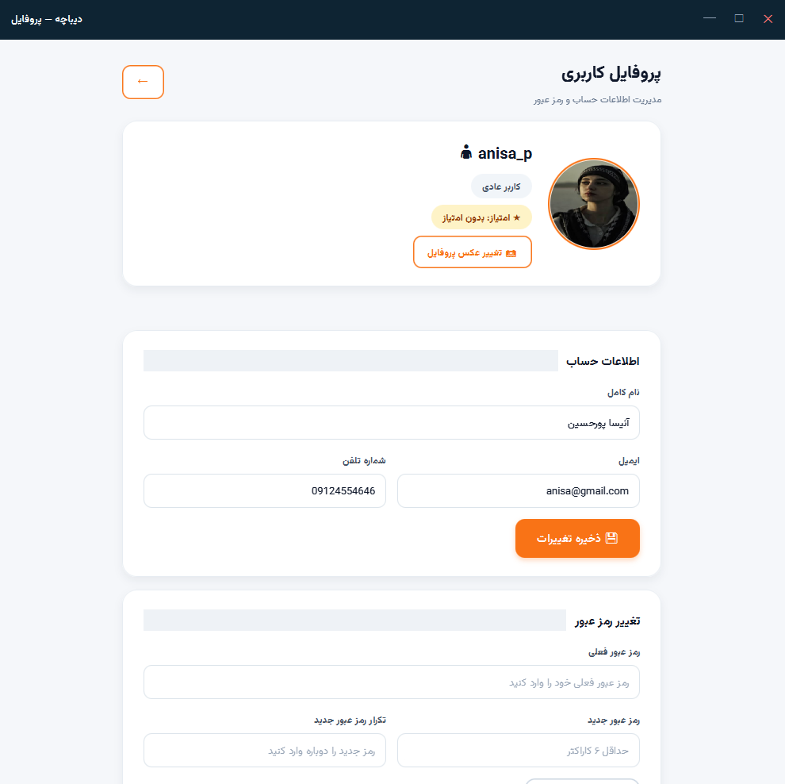
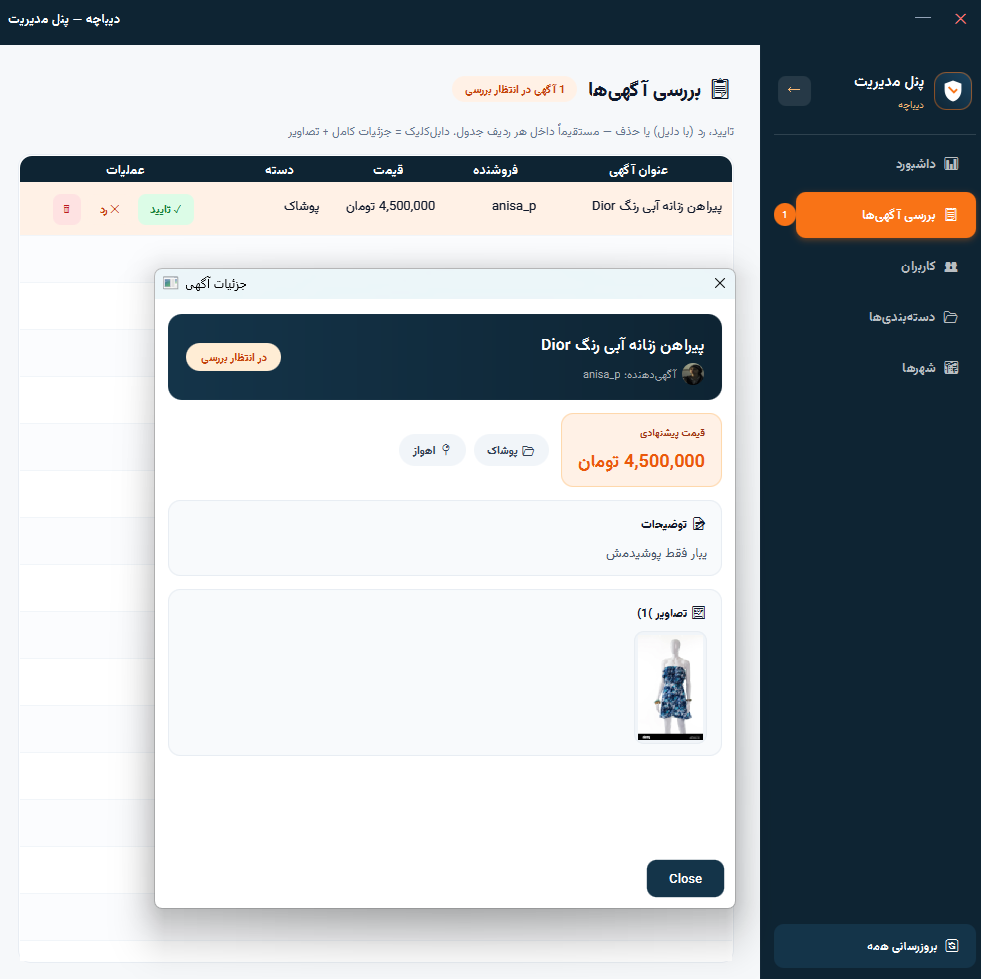
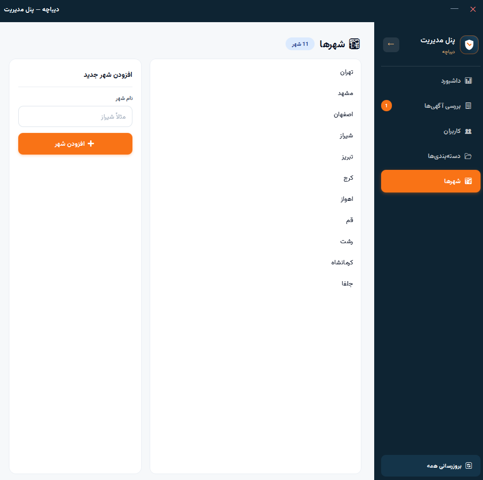

# دیباچه — سامانه خرید و فروش کالای دست‌دوم

پروژه درس برنامه‌سازی پیشرفته — سامانه ثبت و مدیریت آگهی‌های کالای دست‌دوم با معماری Client/Server.

## 👥 اعضای گروه

- بیتا قیاسوند جوزانی — ۴۰۴۳۱۰۴۷
- عطا ترکمانی زاده علمداری — ۴۰۴۳۱۴۱۲

## 🧑‍💻 تقسیم کار

- **بک‌اند (Spring Boot):** عمدتاً بر عهده **بیتا** بوده است.
- **فرانت‌اند (JavaFX):** عمدتاً بر عهده **عطا** بوده است.
- هر دو نفر در هر دو بخش به یکدیگر کمک کرده‌ایم.
- **راه‌اندازی و ستاپ دیتابیس:** بر عهده **عطا** بوده است.
- **توکن و احراز هویت (JWT):** بر عهده **بیتا** بوده است.

## 🏗️ معماری و تکنولوژی‌ها

| بخش | تکنولوژی                                        |
|------|-------------------------------------------------|
| Backend | Java 25 + Spring Boot (REST API)                |
| Frontend | JavaFX 25 (FXML)                                |
| دیتابیس | SQLite (فایل `secondhand.sqlite` در ریشه پروژه) |
| احراز هویت | JWT (Bearer Token)                              |
| ارتباط | HTTP/JSON روی پورت 8080                         |

## 🚀 نحوه اجرا

**پیش‌نیاز:** JDK 21 یا بالاتر و Maven

### ۱) اجرای بک‌اند (سرور)

```bash
cd Backend
mvn spring-boot:run
```

سرور روی `http://localhost:8080` بالا می‌آید. در اولین اجرا، دیتابیس SQLite به همراه داده‌های اولیه (کاربران تست، شهرها و دسته‌بندی‌ها) به صورت خودکار ساخته می‌شود.

### ۲) اجرای فرانت‌اند (کلاینت JavaFX)

```bash
cd Frontend
mvn clean javafx:run
```

> ⚠️ ابتدا بک‌اند را اجرا کنید، سپس فرانت‌اند را.

### تنظیم آدرس Backend در Frontend

به‌صورت پیش‌فرض، Frontend به آدرس زیر وصل می‌شود:

```text
http://127.0.0.1:8080/api
```

برای اجرای Backend روی آدرس دیگر، می‌توانید هنگام اجرای Frontend یکی از این تنظیمات را بدهید:

```bash
mvn javafx:run -Dsecondhand.api.url=http://localhost:8080/api
```

یا متغیر محیطی تنظیم کنید:

```bash
SECONDHAND_API_URL=http://localhost:8080/api
```

اگر آدرس بدون `/api` داده شود، Frontend آن را به‌صورت خودکار اضافه می‌کند.

## 🔑 حساب‌های تست

| نقش | نام کاربری | رمز عبور |
|-----|-----------|---------|
| ادمین | `admin` | `admin123` |
| کاربر عادی | `testuser` | `123456` |

## ✨ امکانات

### کاربران
- ثبت‌نام و ورود با JWT
- صفحه پروفایل: ویرایش اطلاعات حساب، **آپلود عکس پروفایل** و تغییر رمز عبور
- نمایش **میانگین امتیاز فروشندگی** در پروفایل
- مسدودسازی کاربران توسط ادمین (کاربر مسدود امکان ورود ندارد)

### آگهی‌ها
- ثبت آگهی با عنوان، توضیحات، قیمت، دسته‌بندی، شهر و **حداکثر ۵ تصویر** (هر تصویر حداکثر ۵ مگابایت — آپلود multipart)
- انتخاب دسته‌بندی به صورت **سلسله‌مراتبی** (دسته اصلی ← زیردسته‌ها؛ خود دسته اصلی هم قابل انتخاب است)
- چرخه وضعیت: `PENDING` ← `APPROVED` / `REJECTED` (با دلیل) ← `SOLD` — حذف به صورت منطقی (`DELETED`)
- فقط آگهی‌های تاییدشده برای عموم نمایش داده می‌شوند
- ویرایش/حذف/اعلام فروخته‌شدن فقط توسط مالک آگهی
- جست‌وجوی لحظه‌ای + فیلتر ترکیبی (کلیدواژه، دسته‌بندی، شهر، محدوده قیمت)
- مرتب‌سازی نتایج: جدیدترین/قدیمی‌ترین، قیمت و **بالاترین امتیاز فروشنده**
- مشاهده **پروفایل و امتیاز فروشنده** با کلیک روی نام فروشنده در صفحه جزئیات آگهی

### خرید و امتیازدهی
- **دکمه خرید** روی هر آگهی فعال؛ پس از خرید، آگهی `SOLD` می‌شود و در بخش «خریدها»ی خریدار قرار می‌گیرد
- امتیازدهی ۱ تا ۵ به فروشنده **فقط توسط خریدار همان آگهی** — هم هنگام خرید و هم بعداً از بخش «خریدها»
- هر خریدار فقط یک بار می‌تواند امتیاز دهد؛ امتیاز به خود مجاز نیست
- **تاریخچه خریدها** با امکان ثبت امتیاز — دوبار کلیک روی هر ردیف برای مشاهده جزئیات آگهی

### نظرات (Comments)
- کاربران می‌توانند روی هر آگهی نظر ثبت کنند
- صاحب نظر و ادمین می‌توانند نظر را حذف کنند
- تعداد نظرات در صفحه جزئیات آگهی نمایش داده می‌شود

### پنل ادمین
- بررسی و تایید/رد آگهی‌ها (با ثبت دلیل رد) — با کلیک روی هر آگهی، **جزئیات کامل آن (توضیحات و تصاویر)** نمایش داده می‌شود
- لیست کاربران با **نام کاربری**؛ با کلیک روی هر کاربر، صفحه اختصاصی او با آگهی‌های **ثبت‌شده / فروخته‌شده / حذف‌شده / ردشده** و امکان مسدود/فعال‌سازی باز می‌شود
- **مدیریت شهرها**: افزودن شهر جدید توسط ادمین (در کنار مدیریت دسته‌بندی‌ها)

### گفت‌وگو (چت) و تعامل
- چت خریدار و فروشنده روی هر آگهی (چت روی آگهی خود مجاز نیست)
- دکمه «چت با فروشنده» مستقیماً **صفحه چت** را باز می‌کند و گفت‌وگوی مربوطه را انتخاب می‌کند
- **به‌روزرسانی خودکار پیام‌ها** (polling هر ۳ ثانیه)
- **نشانگر پیام خوانده‌نشده**: نقطه نارنجی روی گزینه «گفت‌وگوها» در منوی کاربر تا زمانی که پیام جدید خوانده‌نشده وجود دارد
- علاقه‌مندی‌ها (بدون تکرار)

## 📚 مستندسازی و مدیریت خطا

- کلاس‌های اصلی Backend و Frontend دارای **Javadoc کامل انگلیسی** در سطح کلاس و متد (توضیحات، `@param`، `@return`، `@throws`، `@author` و `@version`) هستند (کنترلرها، سرویس‌ها، ریپازیتوری‌ها، انتیتی‌ها و ابزارها).
- مدیریت خطاها به‌صورت متمرکز در `GlobalExceptionHandler` انجام می‌شود و همه پاسخ‌های خطا با **status code استاندارد** (400/401/403/404/405/409/413/415/500) و پیام فارسی برگردانده می‌شوند؛ خطاهای پیش‌بینی‌نشده نیز در لاگ سرور ثبت می‌شوند.
- برای بخش‌های مهم منطق بیزنس، **تست واحد با JUnit 5 و Mockito** نوشته شده است (بخش «تست‌های واحد»).

## 🧪 تست‌های واحد (JUnit)

تست‌های واحد با **JUnit 5 + Mockito** برای مهم‌ترین متدهای لایه سرویس بک‌اند نوشته شده‌اند و در مسیر `Backend/src/test/java/com/secondhand/backend/service/` قرار دارند:

| کلاس تست | چه چیزی را تست می‌کند |
|----------|----------------------|
| `ItemServiceTest` | مرتب‌سازی جست‌وجوی پیشرفته (جدیدترین، قیمت صعودی، بالاترین امتیاز فروشنده)، اعتبارسنجی قیمت منفی و عنوان خالی، خرید مستقیم (خرید آگهی خود ❌، آگهی فروخته‌شده ❌، خرید موفق + رد خودکار درخواست‌های در انتظار ✅) |
| `CityServiceTest` | افزودن شهر توسط ادمین ✅، کاربر غیرادمین ❌ (403)، نام تکراری ❌ (400)، دریافت لیست شهرها |
| `UserServiceTest` | تشخیص نقش ادمین (کاربر ادمین، کاربر عادی، کاربر ناموجود ← 404) |

**اجرای تست‌ها:**

```bash
cd Backend
mvn test
```

خروجی موفق چیزی شبیه `Tests run: 15, Failures: 0, Errors: 0` خواهد بود. تست‌ها به دیتابیس یا سرور واقعی نیاز ندارند؛ همه وابستگی‌ها با Mockito شبیه‌سازی (mock) می‌شوند.

## 📷 گزارش تصویری قابلیت‌ها (اسکرین‌شات)

> 📌 اسکرین‌شات‌ها را در پوشه `docs/screenshots/` با نام‌های زیر قرار دهید تا به‌صورت خودکار در همین بخش نمایش داده شوند.

### ورود و ثبت‌نام
صفحه ورود با برند «دیباچه» و فرم ثبت‌نام با اعتبارسنجی.


### لیست آگهی‌ها + جست‌وجو و فیلتر
جست‌وجوی لحظه‌ای، فیلتر ترکیبی (دسته‌بندی، شهر، محدوده قیمت) و مرتب‌سازی نتایج از جمله بر اساس امتیاز فروشنده.


### جزئیات آگهی و خرید
نمایش تصاویر، نظرات، پروفایل و امتیاز فروشنده، دکمه خرید و چت با فروشنده.



### گفت‌وگو (چت) و نشانگر پیام خوانده‌نشده
چت خریدار/فروشنده روی هر آگهی + نقطه نارنجی پیام جدید روی منوی «گفت‌وگوها».





### پروفایل و امتیازدهی
ویرایش حساب، آپلود عکس پروفایل و نمایش میانگین امتیاز فروشندگی.



### پنل ادمین
تایید/رد آگهی‌ها، مدیریت کاربران (با بخش آگهی‌های ردشده)، مدیریت دسته‌بندی‌ها و **شهرها**.





## 📁 ساختار پروژه

```
secondhand-marketplace/
├── Backend/                  # سرور Spring Boot
│   └── src/main/java/com/secondhand/backend/
│       ├── controller/       # REST APIها
│       ├── service/          # منطق بیزنس
│       ├── repository/       # دسترسی به دیتابیس (JPA)
│       ├── entity/           # موجودیت‌ها
│       ├── dto/              # اشیای انتقال داده
│       ├── security/         # JWT و فیلترها
│       └── config/           # پیکربندی امنیت، آپلود و داده اولیه
├── Frontend/                 # کلاینت JavaFX
│   └── src/main/
│       ├── java/com/secondhand/frontend/
│       │   ├── controller/   # کنترلرهای FXML
│       │   ├── service/      # ارتباط با API
│       │   ├── model/        # مدل‌ها
│       │   └── util/         # SessionManager، WindowUtil و ...
│       └── resources/com/secondhand/frontend/  # FXML، CSS و تصاویر
├── docs/screenshots/         # اسکرین‌شات‌های بخش «گزارش تصویری» README
└── README.md
```

## 📌 نکات فنی

- تصاویر آگهی‌ها و عکس‌های پروفایل در پوشه `uploads/` کنار محل اجرای بک‌اند ذخیره و از مسیر `http://localhost:8080/uploads/...` سرو می‌شوند.
- پاسخ خطاهای API به فرمت زیر است (کد عددی خطا در فیلد `statusCode` است، نه `status`):
  ```json
  {"message": "متن خطا به فارسی", "statusCode": 400, "status": "BAD_REQUEST", "timestamp": "2026-01-01T12:00:00", "path": "/api/..."}
  ```
- JWT secret از متغیر محیطی `JWT_SECRET` خوانده می‌شود. مقدار داخل `application.properties` صرفاً یک fallback توسعه برای اجرای سریع پروژه است و در محیط واقعی باید حتماً از طریق متغیر محیطی تنظیم شود.
- برای پاک کردن دیتابیس و شروع مجدد، فایل `secondhand.sqlite` را حذف کنید.
- فرمت‌های مجاز تصویر: JPG، JPEG، PNG، GIF، BMP، WEBP
- نسخه اصلی توسعه Backend: **Java 25**. برای اجرای پروژه از JDK 25 استفاده کنید.
- آدرس Frontend قابل تنظیم ��ست؛ مقدار پیش‌فرض `http://127.0.0.1:8080/api` است.

## 🛠️ تنظیمات توسعه

### اجرای Backend با Java 25

```bash
cd Backend
./mvnw spring-boot:run
```

### اجرای تست و build

```bash
cd Backend
./mvnw clean test

cd ../Frontend
./mvnw clean package
```

اگر Maven نتوانست dependencyها را دانلود کند، اتصال اینترنت، تنظیمات proxy و trust store مربوط به JDK 25 را بررسی کنید. خطای `handshake_failure` مربوط به ارتباط TLS با Maven Central است، نه خطای کد پروژه.

### تنظیم آدرس API در Frontend

به‌صورت پیش‌فرض Frontend از این آدرس استفاده می‌کند:

```text
http://127.0.0.1:8080/api
```

با system property:

```bash
cd Frontend
./mvnw javafx:run -Dsecondhand.api.url=http://localhost:8080/api
```

یا با environment variable:

```bash
export SECONDHAND_API_URL=http://localhost:8080/api
```

اگر مقدار تنظیم‌شده `/api` نداشته باشد، Frontend آن را خودکار اضافه می‌کند.

### پاک‌سازی دیتابیس توسعه

قبل از حذف دیتابیس از اطلاعات آن backup بگیرید:

```bash
cp Backend/secondhand.sqlite Backend/secondhand.sqlite.backup
rm Backend/secondhand.sqlite
```

با اجرای دوباره Backend، SQLite و داده‌های اولیه ساخته می‌شوند.

## ✅ وضعیت فنی فعلی

- خرید هم‌زمان با optimistic locking کنترل می‌شود.
- نام فایل‌های آپلودی با UUID ساخته می‌شود.
- خطاهای API در Frontend از پاسخ استاندارد Backend استخراج می‌شوند.
- خطاهای غیرقابل‌توجه Frontend در log مرکزی ثبت می‌شوند.
- برای جست‌وجوهای پرتکرار دیتابیس index اضافه شده است.
- تست‌های واحد JUnit برای سرویس‌های مهم بک‌اند در `Backend/src/test/` نوشته شده‌اند؛ برای اجرای آن‌ها Maven باید بتواند dependencyها را دانلود کند (اتصال اینترنت).
